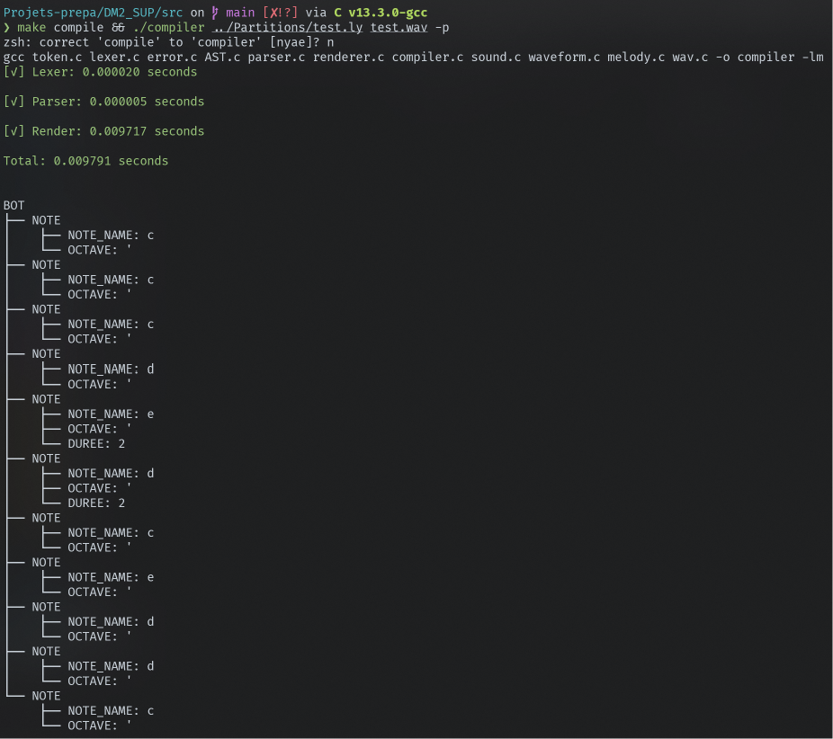
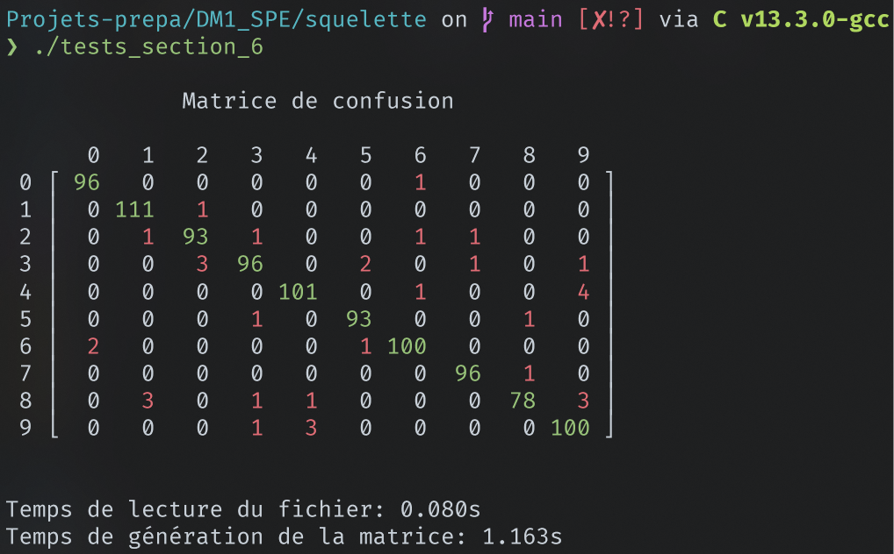
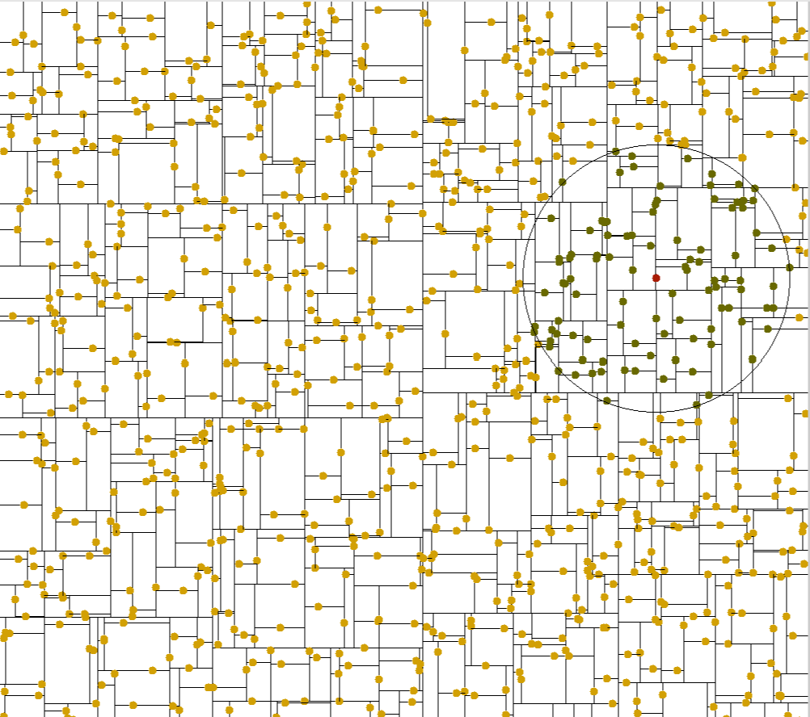
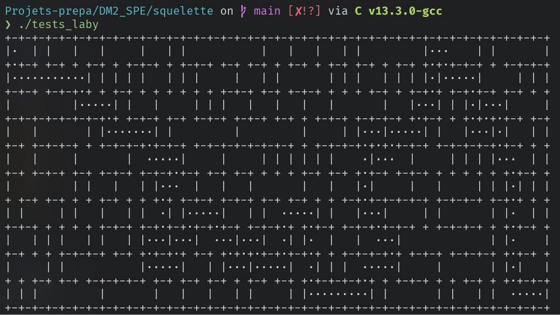

Ce dépot répertorie les différents devoirs maison effectués pendant mes deux années de CPGE MPI en informatique.

# DM2_SUP: Compilateur LilyPound


Le DM original consiste à développer un programme permettant
d'écrire un fichier au format wav. Plus précisément d'implémenter la spécification du format wav, ainsi que la génération de plusieurs signaux: sin, toothwave etc ... et enfin la mise en place d'un format simple permettant d'écrire de la musique.


De plus, il était demandé de développer une fonctionnalité supplémentaire au choix. J'ai choisi d'implémenter un compilateur Lilypound vers wav. [LilyPound](https://lilypond.org/index.html) est un format pour écrire des partitions de musique faisant partie du projet GNU. Bien que le rendu audio que j'ai développé reste très simple et peu complet, la partie analyse lexical et syntaxique de mon programme est assez fournie.

Pour plus d'informations sur le projet, lire la [Documentation](https://github.com/ebdm13/Projets-prepa/blob/main/DM2_SUP/Documentation.md)

# DM3_SUP: SAT solveur
Ce DM consiste à développer un SAT solveur et à modéliser quelques problèmes classiques (comme le problème des n dames). La première méthode utilisée est la force brute. Dans un second temps, il était aussi demandé d'implémenter l'algorithme de Quine et une version spécifique aux formules sous FNC. Afin d'améliorer les performances du SAT solver, j'ai mis en place diverses optimisations notamment grâce à l'implémentation des arbres rouge-noir. Ainsi, le problème des 25 dames qui était impossible à résoudre en temps raisonnable est résolu en 7 secondes par la version optimisée.

# DM1_SPE: Algorithme des k plus proches voisins et arbres k-dimensionnels


Il est question dans ce DM d'implémenter l'algorithme des K plus proches voisins. D'abord en C en temps linéaire, puis en Ocaml en temps logarithmique avec l'implémentation des arbres k-dimensionnels. La partie en C contient aussi une application de cet algorithme qui consiste à déterminer le chiffre représenté sur une image avec la base de données MNIST.

# DM2_SPE: Labyrinthe

Ce DM porte sur les Labyrinthes. On génère un labyrinthe parfait, d'abord avec un parcours en profondeur, puis en utilisant la structure union find précédemment implémentée. Puis on implémente une fonction qui permet de trouver la solution du labyrinthe. Enfin, on nous demande de: "Définir une fonction void repare(laby_t laby) qui transforme laby (i.e. ajoute des murs
et supprime des murs) en un labyrinthe parfait. On ne veut pas créer un labyrinthe lf sans
rapport avec le labyrinthe initial li, au contraire pour deux cases a et b, s’il existait des chemins
reliant a et b dans li, celui qui existe dans lf doit être l’un d’eux. De plus on évitera de créer des
murs qu’on supprime ensuite...".

J'ai particulièrement aimé cette partie et notamment la solution que j'ai trouvée, qui est, je trouve, très simple et efficace:
```c
/* Laby est un labyrinth quelconque.
 * "Répare" laby i.e rend laby parfait tout en conservant
 * au moins un chemin qui existait déjà entre deux cases.
 * (En temps linéaire: O(wh)).
 */
void repare(laby_t laby){
    int w = laby.width, h = laby.height;
    bool* visited = calloc(w * h, sizeof(bool));
    for (int i = 0; i < h; i++) {
        for (int j = 0; j < w; j++) {
            int cl = linearise(laby, i, j);
            if (!visited[cl]){
                visited[cl] = true;
                build_walls(laby, visited, i, j, cl);
                if (j > 0){
                    casse_mur(laby, i, j, i, j-1);
                } else if (i > 0) {
                    casse_mur(laby, i, j, i-1, j);
                }
            }
        }
    }
    free(visited);
}

```

# DM3_SPE: Problème du sac à dos

L'objectif de ce devoir maison est de modéliser et de résoudre le problème du sac à dos. D'abord par force brute, puis par programmation dynamique et enfin en utilisant le Branch and Bound et en particulier en utilisant le problème fractionnaire pour trouver un majorant. (Il y est donc aussi question d'implémenter les rationnels)
